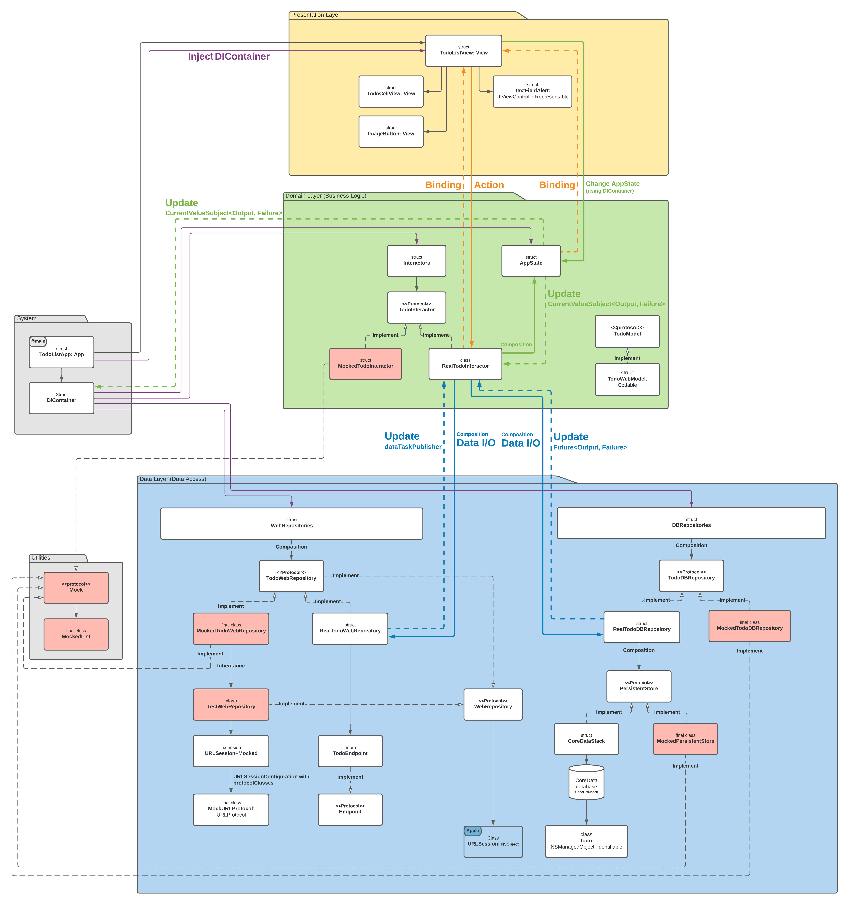

# Todo List App

TodoList is an application that helps you to manage your todo tasks, and allows to:
- Fetch list of the todos
- Add new todo
- Edit todo
- Delete todo

## Architecture

This application is implemented in Clean architecture with three layers:
- **Presentation layer**
  - Contains `Views` and cells
  
- **Domain layer**
  - `RealTodoInteractor` - Connect between presentation layer and data layer, implements `TodoInteractor`.
  - `TodoWebModel`- Model that we got from the server, implements `TodoModel` and `Codable`.
  - `AppState` - Routing to each screen (Will be available in the future).

- **Data Layer**
  - **WebRepositories**:
  - `WebRepository` - Retrieves data from the server using `dataTaskPublisher`.
  - `TodoWebRepository` - Allow us to get all, update, change and delete todos, implements `WebRepository` protocol. `RealTodoWebRepository` and `MockTodoWebRepository` (For Tests) - Implement `TodoWebRepository` protocol (Strategy design pattern).
  - `RealTodoWebRepository` - Allow us to communicate with the server using URLSession, implements `TodoWebRepository` protocol.
  - `WebError` - The error that `WebRepository` can throw.
  - `Endpoint` - Prepares the URLRequest to connect to the server (`TodoEndpoint` implements this protocol).
  - `HTTPMethod` - The HTTP methods that allow in this application.
  - `MockTodoWebRepository` (For Tests) - Allow us to communicate with fake server, implements `TodoWebRepository` and `TestWebRepository`.
  - `TestWebRepository` (For Tests) - Retrieves data from fake server using mocked session, implements `WebRepository`.
  - `MockURLProtocol` (For Tests) - Get request and return mock response, implements `URLProtocol`.
  - `MockWebError` (For Tests) - The error that `TestWebRepository` can throw.

   - **DBRepositories**:
  - `PersistentStore` - Allow us to fetch, update and delete items from `CoreData` database. `CoreDataStack` and `MockPersistentStore` (For Tests) - Implement `PersistentStore` protocol (Strategy design pattern).
  - `CoreDataStack` - Allow access to `CoreData` storage, implements `PersistentStore`.
  - `MockPersistenceController` (For Tests) - Allow access to in-memory storage for testing, implements `PersistentStore`.
  - `TodoDBRepository` - Allow us to fetch todo list, fetch todo by id, save todo list and delete todo. `RealTodoDBRepository` and `MockTodoDBRepository` (For Tests) - Implement `TodoDBRepository` protocol (Strategy design pattern).
  - `RealTodoDBRepository` - Allow us to use `CoreDataStack` to fetch, update and delete items from `CoreData`, implements `TodoDBRepository`.
  -  `MockTodoDBRepository` (For Tests) - Allow us to use `MockPersistenceController` to fetch, update and delete items from in-memory storage, implements `TodoDBRepository`.
  - `Todo` - Model that we save in `CoreData` database, this model is shown in `Views`. `Todo` model inherit from `NSManagedObject` class and implements `Identifiable` protocol.

- **System**
  - `TodoListApp` - An entry point to this application.
  - `DIContainer` – Help us to inject the dependencies (Dependency injection design patterns) holds the `Interactors`, `DBRepositories`, `WebRepositories` and  `AppState`.

## Server API
- Get a list of all todos
  - HTTP Method: `GET`
  - URL: [`https://todo-list-app1234.herokuapp.com`](https://todo-list-app1234.herokuapp.com)

- Create a new todo
  - HTTP Method: `POST`
  - URL: `https://todo-list-app1234.herokuapp.com`

- Delete todo
  - HTTP Method: `DELETE`
  - URL: `https://todo-list-app1234.herokuapp.com/{id}`

## Installation
### System requirement
- iOS 14.0 or later

### Install the TodoList applciation
1. Open the `TodoList.xcodeproj` file and run it in Xcode

## Tests

### Unit Tests
Run unit tests:
1. Navigate to `TodoListTests` target

2. Run the test from `Product` ➞ `Test` or use `⌘U` shortcuts

### Performance Tests
Run performance tests:
1. Navigate to `TodoListPerformanceTests` target

2. Run the test from `Product` ➞ `Test` or use `⌘U` shortcuts

### UI Tests
Run UI tests:
1. Navigate to `TodoListUITests` target

2. Run the test from `Product` ➞ `Test` or use `⌘U` shortcuts

### Screen recording

